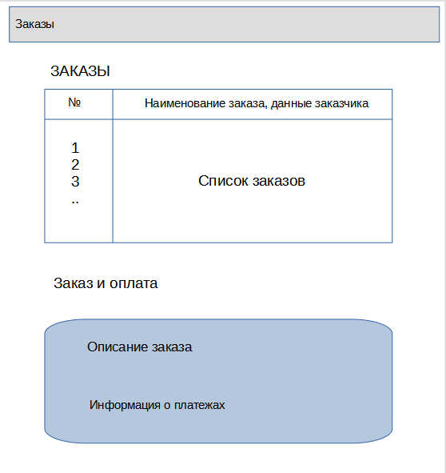

# otkotlin-prj Система учета оплаты

Система учета оплаты -- это программа, в которой ведется информация о заказе/услугах, сроках выполнения и оплате.
Задача программы -- предоставлять информацию о поступающих платежах и наличию задолженностей по заказу.

Пример применения -- автосервис. На начальном этапе формируется заказ с перечнем работ (кузовные работы, покраска деталей), по мере выполнения работу могут вноситься корректировки по срокам и стоимости деталей и материалов. Конечный результат -- сформированный счет на оплату, с учетом возможных предоплат.

## Визуальная схема фронтенда

## Документация

1. Маркетинг и аналитика
    1. [Целевая аудитория](./docs/01-biz/01-target-audience.md)
    2. [Заинтересанты](./docs/01-biz/02-stakeholders.md)
    3. [Пользовательские истории](./docs/01-biz/03-bizreq.md)
2. Аналитика:
    1. [Функциональные требования](./docs/02-analysis/01-functional-requiremens.md)
    2. [Нефункциональные требования](./docs/02-analysis/02-nonfunctional-requirements.md)
3. Архитектура
    1. [Описание API](docs/03-architecture/01-api.md)
    2. [Архитектурные схемы](docs/03-architecture/02-arch.md)
4. DevOps
    1. [Файлы сборки](./deploy)

# Структура проекта

### Плагины Gradle сборки проекта

1. [build-plugin](build-plugin) Модуль с плагинами
2. [BuildPluginJvm](build-plugin/src/main/kotlin/BuildPluginJvm.kt) Плагин для сборки проектов JVM
2. [BuildPluginMultiplarform](build-plugin/src/main/kotlin/BuildPluginMultiplatform.kt) Плагин для сборки
   мультиплатформенных проектов

## Проектные модули

### Транспортные модели, API

